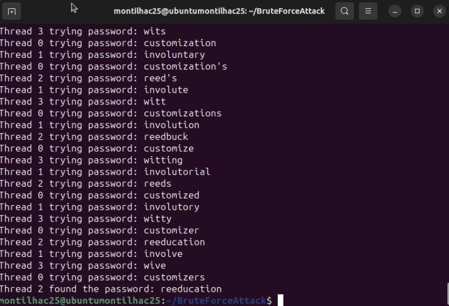
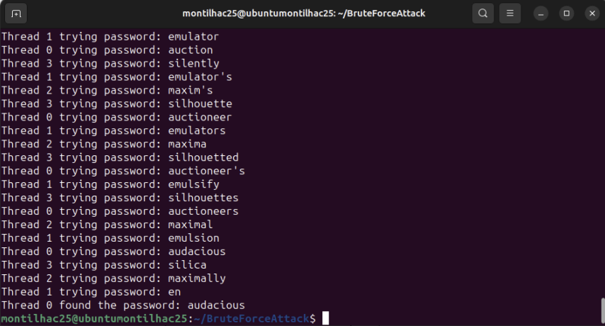

# BruteForceGPG 🔒

A C program implementing a **brute force attack** using multithreading to crack passwords for **GPG-encrypted files**. This project includes dictionary-based password testing using the `cracklib-small` dictionary (55,000+ passwords) against `mainsecret.gpg` and `crack-tiny` (a smaller dictionary for testing) against `secret1.gpg`.

---

## Features
- **Multithreaded brute-force** attack for increased speed.
- Uses **dictionary-based password testing** for efficiency.
- Works on GPG-encrypted files like `mainsecret.gpg` and `secret1.gpg`.
- Written in **C** and optimized for performance.

---
  
## Secrets Obtained 🗝️
- Secret for **mainsecret.gpg**: `reeducation`
- Secret for **secret1.gpg**: `audacious`

---

## Execution Examples 

**Brute Force Execution for `mainsecret.gpg`:**



**Brute Force Execution for `secret1.gpg`:**



---

## How It Works
The program reads a dictionary file and tests each word as a possible password. Multithreading is implemented to speed up the process by splitting the password guesses among different threads.

---

## Usage

### Compile the Program
Use the following command to compile the program:
```
gcc -o decrypt dictRead.c testGPG.c -lpthread
```
---

## Run the Program

For testing with the smaller dictionary and file:
```
./decrypt secret1.gpg crack-tiny.txt
```

For the full test with the larger dictionary:
```
./decrypt mainsecret.gpg /usr/share/dict/cracklib-small
```

---

## Installation and Usage 

1. Clone the repository:
```
git clone https://github.com/cmontilha/BruteForceGPG.git
```
2. Navigate to the directory:
```
cd BruteForceGPG
```
3. Compile the C files:
```
gcc -o decrypt dictRead.c testGPG.c -lpthread
```
4. Run the program
Use the following command to compile the program:
```
gcc -o decrypt dictRead.c testGPG.c -lpthread
```

---

## Technologies Used 
- **C programming language**
- **Multithreading** with `pthread`
- **GPGME library** for handling GPG files
- **Ubuntu** for running the tests

---

⚠️ **Important Disclaimer** ⚠️  
This project is created for **educational purposes only**. The goal is to demonstrate multithreading and dictionary-based brute force techniques in a controlled environment. It should **not** be used for illegal or malicious purposes.

---

## Contributing 
Feel free to submit pull requests or open issues if you want to improve or contribute to this project.

---

## License 
This project is licensed under the MIT License.

